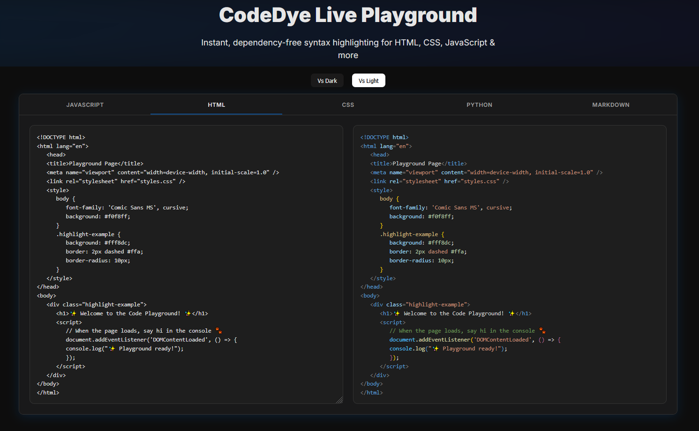

# 🎨 CodeDye

**CodeDye** is a lightweight, dependency-free syntax highlighter powered by Monaco/VS Code–style tokenization.  
It supports static code highlighting, live previews, and fully custom themes — perfect for playgrounds, docs, and dev tools.

> 🔗 [Live Playground Demo](https://tezumie.github.io/codedye/)



---

## 🚀 Features

- 🎯 Accurate VS Code–style syntax tokenization
- ⚡ Fast, no dependencies (no Prism/Highlight.js)
- 🧠 Auto language detection from `language-xxx` classes
- 💡 Built-in support: JavaScript, CSS, HTML, Python, Markdown
- 🌈 Custom themes with per-token CSS targeting
- 🪄 Live preview for editors/playgrounds
- 🧩 Extendable with (mostly)Monaco-compatible tokenizer rules

---

## 📦 Getting Started

Include a theme + script using CDN:

```html
<!-- 1. Theme (dark or light) -->
<link rel="stylesheet" href="https://cdn.jsdelivr.net/gh/Tezumie/codedye@main/dist/themes/vs-code-dark.css" />
<!-- 2. Core Script -->
<script src="https://cdn.jsdelivr.net/gh/Tezumie/codedye@main/dist/builds/codedye.all.umd.js"></script>


<!-- Other themes -->
<!-- <link rel="stylesheet" href="https://cdn.jsdelivr.net/gh/Tezumie/codedye@main/dist/themes/vs-code-light.css" /> -->
<!-- <link rel="stylesheet" href="https://cdn.jsdelivr.net/gh/Tezumie/codedye@main/dist/themes/one-dark.css" /> -->
```

> Or load a single language bundle (e.g. `codedye.css.umd.js`) if you don’t need all languages.

---

## ✍️ Usage

### ✅ Auto-Highlight on Page Load

After including the script, CodeDye automatically highlights all `<pre><code class="language-xxx">` blocks on `DOMContentLoaded`.

```html
<pre><code class="language-js">const x = 42;</code></pre>
```

---

### 🔁 Re-Highlight After DOM Changes

```js
CodeDye.highlight();
```

---

### 🧱 Highlight a Specific Block

```js
CodeDye.highlightBlock(document.querySelector('#myCodeBlock'));
```

---

### ⚡ Live Editor Preview

```js
CodeDye.init({
  source: '#editor',       // textarea selector or element
  target: '#preview',      // container for highlighted code
  language: 'js',          // 'js', 'html', 'css', 'py', 'md'
  debounce: 30             // optional delay in ms
});
```

---

### 🔄 Convert Code to HTML

```js
const html = CodeDye.highlightElement('const x = 1;', { language: 'js' });
```

This returns a string of syntax-highlighted HTML you can inject anywhere.

---

## 🌐 Supported Languages

- ✅ JavaScript / TypeScript (`js`, `ts`)
- ✅ HTML (`html`)
- ✅ CSS (`css`)
- ✅ Python (`py`)
- ✅ Markdown (`md`)

> You can register your own tokenizers in `src/languages/`.

---

## 🎨 Theming

CodeDye uses semantic token classes like:

```html
<span class="keyword css-keyword">...</span>
<span class="string py-string">...</span>
```

Built-in themes:
- `vs-code-dark.css`
- `vs-code-light.css`

To create your own, just override these styles with CSS.

---

## 🔍 Monaco Tokenizer Compatibility

Many tokenization rules in CodeDye are adapted from the  
[Monaco Editor’s Monarch tokenizer system](https://microsoft.github.io/monaco-editor/monarch.html).

This provides:

- ✅ Easy rule reuse from Monaco/VS Code ecosystem  
- 🌱 Extendability with a large, proven base of language grammars  
- 🛠 Familiar regex patterns for building your own

> Thanks to the Monaco team for making such a powerful system open-source.

---

## 🛠️ Build Setup (for contributing)

```bash
# Install dev dependencies
npm install

# Build all UMD bundles (per language + full)
npm run build
```

> Uses Rollup with `@rollup/plugin-virtual`, `resolve`, and `terser`.

---

## 📦 Rollup Output

```bash
# Full bundle (all langs)
dist/builds/codedye.all.umd.js

# Individual language builds
dist/builds/codedye.js.umd.js
dist/builds/codedye.css.umd.js
...
```

To add a new language:
- Drop a file in `src/languages/`
- Rebuild with `npm run build`

---

## 📚 License

MIT License © 2025 — Made with ❤️ by [Tezumie](https://github.com/Tezumie)
